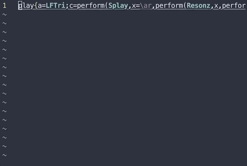

### WORK IN PROGRESS: SC Formatter VIM plugin
##### A very crude autoformatter for SuperCollider code

Using regex to do simple autoformatting in SuperCollider code in Vim, mostly 
to make padding around operators nice and consistent

Install using pathogen: `cd ~/.vim/bundle && git clone https://github.com/datamads/SCFormatter`

